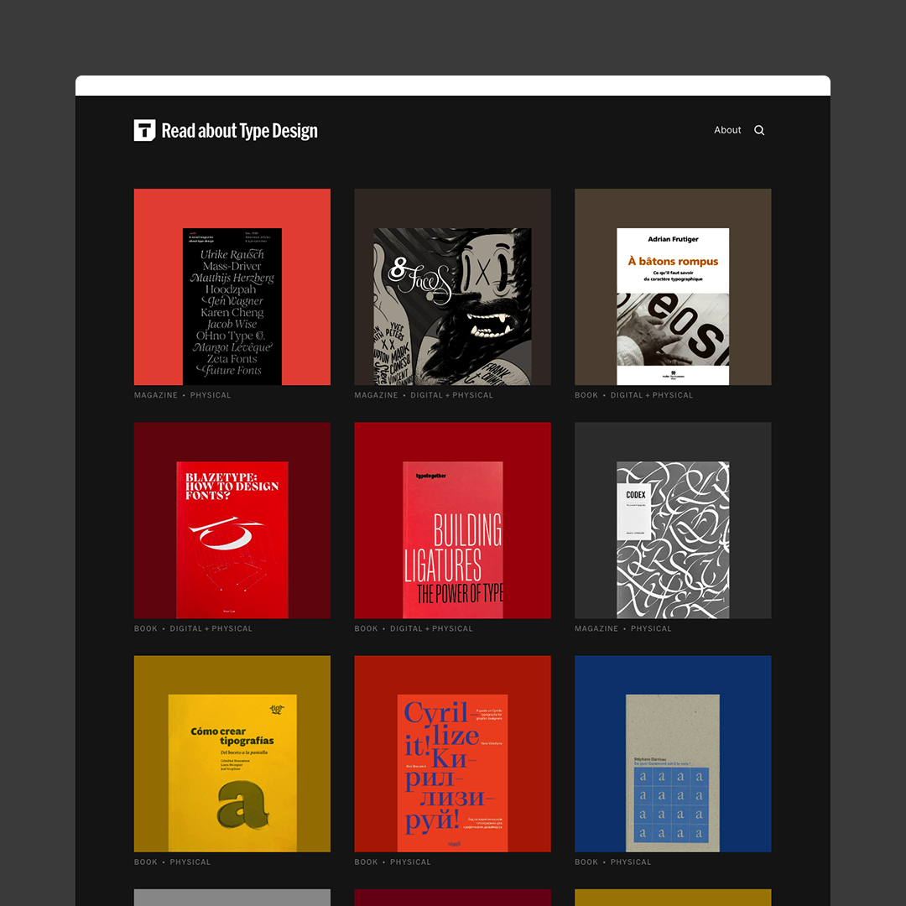

# Styles & components samples


## Heading 1

Unordered list:

* To laugh often and much;
* To win the respect of intelligent people and the affection of children;
* To earn the appreciation of honest critics and endure the betrayal of false friends;
* To appreciate beauty, to find the best in others;
* To leave the world a bit better, whether by a healthy child, a garden patch, or a redeemed social condition;
* To know even one life has breathed easier because you have lived.
* This is to have succeeded.

### Heading 2

Ordered list:

1. I wrote a letter on a cassette and sent it in the mail
2. To give chase when your ship was setting sail
3. Problem is that the devil’s in the detail
4. I need to feel your touch, put my fingers to the brail
5. So I sit and wait for you to write back
6. Up late sippin’ on an eternal nightcap

#### Heading 3

Paragraph: now there comes a time in every young person’s life where they need to figure out where they belong and what path they should take in this world. We often find ourself walking in another person’s shadow because we’ve admired them and followed them for so long. We find ourselves trying to become another person and never really unlock our true creative self

Quote:

> “A brand is made not just by the people who buy it, but also by the people who know about it.” - Sir John Hegarty

Tasks list:

* [ ] Don't be light
* [ ] Don't be light
* [ ] Don't be light
* [ ] Don't be light
* [ ] Don't be light
* [ ] Don't be light

Divider:

***

Hint:


**Hey!** This is a hint component. Good to know.


Code block:

```
// Some code
```

Insert image:


Caption


Insert images:

<div>

<figure><figcaption></figcaption></figure>

 

<figure><figcaption><p>With caption</p></figcaption></figure>

</div>

Embed URL:



Table:

<table><thead><tr><th width="170">Column 1</th><th>Col 2</th><th>E</th></tr></thead><tbody><tr><td>Row one</td><td>—</td><td>—</td></tr><tr><td>—</td><td>—</td><td>—</td></tr><tr><td>—</td><td>—</td><td>—</td></tr></tbody></table>

Cards:

<table data-view="cards"><thead><tr><th></th><th></th><th></th><th data-type="number"></th></tr></thead><tbody><tr><td>Booya!</td><td>Card 1</td><td>Hop.</td><td>42</td></tr><tr><td>Text</td><td>Text</td><td>Text</td><td>43</td></tr><tr><td>Like</td><td>A mini</td><td>Database</td><td>3</td></tr></tbody></table>

Tabs:



So nice!



Nice.



Expandable:

<details>

<summary>You can see what's inside…</summary>

Hello 👋

</details>

Page link:


[Broken link](broken-reference)

